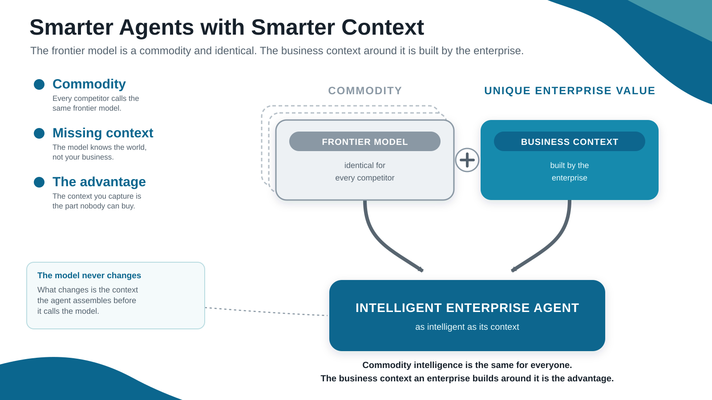
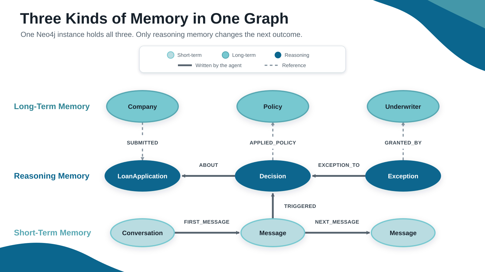
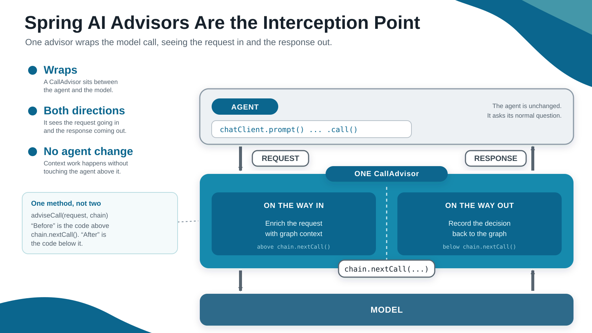
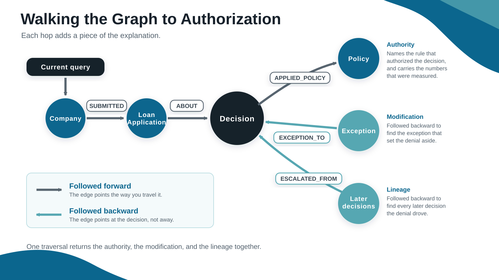
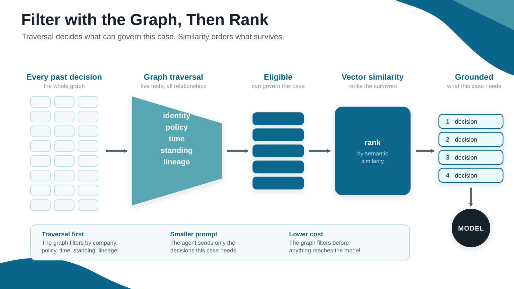
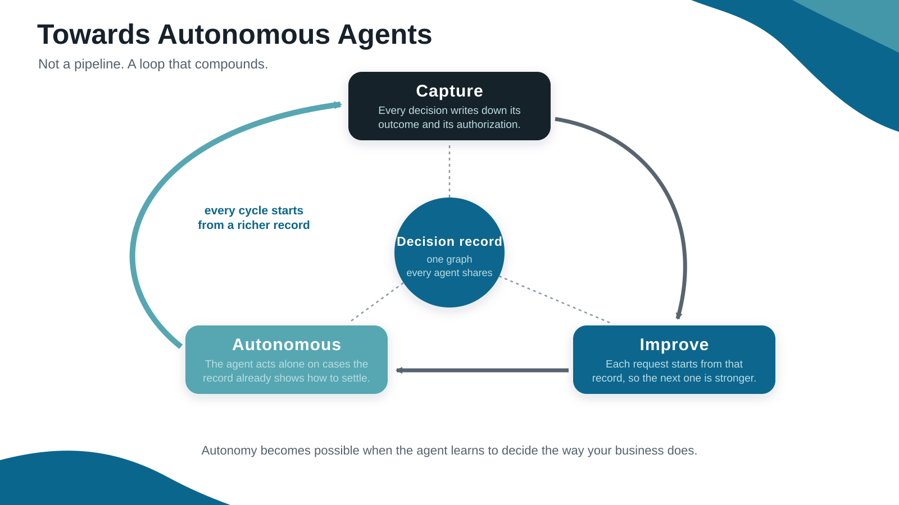

<!-- _class: lead -->


# The Decision Layer
### Shared reasoning for Spring AI agents

Ryan Knight · ryan.knight@neo4j.com

---

## Smarter Models Need Business Context

- **Model capability**: Frontier models reach human-level performance on many defined tasks.
- **Business results**: 95% of enterprise GenAI programs report no measurable return.
- **The business runs the same way it did**: The org chart, the approvals, and the escalation paths are all unchanged.
- **Missing context**: Agents cannot use knowledge held in employee experience, approvals, and past decisions.

> **Business value requires a capable model and the context that guides its decisions.**

<!--
Source: MIT Project NANDA, "The GenAI Divide: State of AI in Business 2025."
95% of organizations studied reported zero return from enterprise GenAI
investment. The report calls its own figures directional.
-->

---



<!--
Slide: Smarter Agents Need Smarter Context

A frontier model is the commodity half of the picture: identical for every
competitor. Business context is the half that is yours alone, and the agent is
only as intelligent as the context it is given.
-->

---

## Data Alone Does Not Explain a Decision

- **Data**: Tells the agent what is true.
- **Policy**: Tells the agent what usually happens.
- **Decision context**: Explains how the policy applies to this case.

> **The missing layer connects business facts to business action.**

<!--
Business data describes the current state. Decision context explains how the
business applies its rules to that state.
-->

---

## What the Decision Layer Captures

- **Evidence**: The facts and trusted sources used in the decision.
- **Policy**: The rule and thresholds applied to the case.
- **Exception**: The approved change to the standard rule.
- **Decision**: The outcome, explanation, and authorizer.
- **Precedent**: Earlier decisions that apply to future cases.

> **Each decision becomes useful context for the next case.**

<!--
Use the $250,000 construction loan as the example. Show which facts came from
the trusted source, which policy applied, whether an exception changed the
rule, who authorized the outcome, and which prior decision became precedent.
-->

---


<!--
Slide: Anatomy of a Decision Graph

The picture makes four claims: what was decided, what authorized it, what
modified it, and what it relied on.
-->

---



<!--
Slide: Three Kinds of Memory in One Graph

Long-term memory holds Company, Policy, and Underwriter nodes. Short-term
memory is the conversation itself, stored by Spring AI through
Neo4jChatMemoryRepository. Reasoning memory is LoanApplication, Decision, and
Exception nodes and the relationships between them.

The dashed edges are the point: the reasoning the agent writes down attaches
straight onto knowledge the business already had. A Decision names the Policy
it applied. An Exception names the Underwriter who granted it.
-->

---

## What Each Kind of Memory Does

- **Long-term memory**: Enterprise knowledge as nodes. Companies, policies, underwriters, thresholds.
- **Short-term memory**: Spring AI stores the conversation through `Neo4jChatMemoryRepository`, in the same database.
- **Reasoning memory**: `Decision` nodes hold what was decided and what authorized it. This is the memory that becomes precedent.

> **One Neo4j instance runs all three. Only reasoning memory changes the next outcome.**

---


<!--
Slide: The Decision Layer Is the Memory Loop

Every agent shares one advisor and one graph: resolve the context that governs
the request, record what was decided, reuse it as precedent.
-->

---

## What Grounded Context Buys You

| Benefit | What it buys you |
|---|---|
| **More accurate answers** | The agent decides on real evidence instead of a guess |
| **Explainability and governance** | Every decision names the policy and the person behind it |
| **Persistent context** | Context has a place to live beyond one prompt |

> **Each one needs the same thing: a record of how the company decides.**

---



<!--
Slide: Spring AI Advisors Are the Interception Point.
The path is request, advisor.before, model, advisor.after, response.
-->

---

## What the Advisor Gives You

- **Interception**: A `CallAdvisor` wraps the model call.
- **Two sides**: The advisor sees the request going in and the response coming out.
- **Composition**: Advisors run as a chain, and the order decides what each one sees.

---


<!--
Slide: Advisor Order Defines the Lifecycle

Both decision advisors sit outside the tool loop, so context is read once and
the decision is written once per turn.
-->

---

## The Decision Layer Arrives by Injection

- **Injected advisors**: Spring hands the agent `precedentAdvisor` and `decisionTraceAdvisor`.
- **Implicit dependency**: The Neo4j starter configures the driver and the chat memory repository. The agent class names neither.
- **No graph code**: The agent holds no Cypher and opens no session.
- **Reusable**: Any agent that registers the same two advisors gets the same decision layer.

> **The agent asks one question. The advisor chain manages the decision context.**

<!--
An agent adopts the decision layer by registering two beans in its builder. The
agent registers them and stops there.
-->

---

## Four Steps: Look Up, Check, Decide, Record

1. **Look up** the company, its policies, its standing denials, and the underwriter
2. **Check** the application against each policy threshold
3. **Decide** through the model, returned as a typed `LoanVerdict`
4. **Record** the decision and its authorization path in Neo4j

> **The model makes the judgement. Java controls the trace: an unknown policy key writes no edge, and an invented citation gets dropped.**

<!--
PrecedentAdvisor owns the read path. DecisionTraceAdvisor owns the write path.
-->

---


<!--
Slide: Each Decision Becomes Context for the Next

The trace is written only after the model decides, and it outlives the
conversation, so the next request starts from what prior work already proved.
-->

---

## A Log Records, a Graph Connects

| A log can answer | A context graph can answer |
|---|---|
| What happened? | Which policy authorized it? |
| Who decided it? | Which exception changed its standing? |
| When was it recorded? | Which later decisions did it govern? |

<!--
A log stores fields about a decision. A graph stores the links between
decisions, and those links are what prove a past decision applies here.
-->

---

## Only the Graph Holds the Links

- **Both hold the decision**: The fields are the same in either store.
- **Only the graph holds the links**: Policy, exception, actor, and lineage stay attached to the decision.
- **The path is the explanation**: Following the links produces the reason, so application code stops reassembling it.

> **Connection decides whether a past decision applies to this case.**

---

## Start at the Company to Find Relevant Decisions

- **Ownership**: The traversal starts at the company node and reaches its decisions through `SUBMITTED` and `ABOUT`.
- **Age**: The denial falls inside the window the policy sets.
- **Standing**: No exception has set the denial aside.

<!--
The search starts at the company and follows its applications to past
decisions. Three tests then decide which of those denials still count.
-->

---

## One Query Settles All Three Tests

```cypher
MATCH (:Company {companyId: $companyId})-[:SUBMITTED]->(:LoanApplication)
      <-[:ABOUT]-(d:Decision {outcome: 'DENIED'})
WHERE d.decidedAt > datetime() - duration({months: $windowMonths})
  AND NOT EXISTS { (:Exception)-[:EXCEPTION_TO]->(d) }
RETURN d
```

> **The company anchors the search, and every test is a relationship, so one query settles all three.**

---



<!--
Slide: Walking from Company to Authorization

Start at one denial and follow its relationships: current query, company,
application, prior decision, the policy that governed it, the exception that
modified it, and the later decisions it influenced.
-->

---

## Each Hop Adds a Piece of the Explanation

- **`APPLIED_POLICY`**: Names the rule that authorized the decision and carries the numbers that were measured.
- **`EXCEPTION_TO`**: Following it backward finds the exception that set the denial aside.
- **`ESCALATED_FROM`**: Following it backward finds every later decision the denial drove.

> **One traversal returns the authority, the modification, and the lineage together.**

---



<!--
Slide: Filter with the Graph, Then Rank by Similarity

Traverse identity, policy, time, standing, and lineage; collect the decisions
that can govern this case; rank that eligible set by semantic similarity; then
ground the model with the decision path.
-->

---

## Traversal First, Ranking Second

- **Traversal first**: The graph filters by company, policy, time, standing, and lineage.
- **Ranking second**: Vector search orders the decisions that survived the filter.
- **Smaller prompt**: The agent sends the decisions this case needs.
- **Lower cost**: The graph filters before anything reaches the model.

---

## The Second Run Sees the First Run's Decision

```shell
./run.sh C-1042 250000
./run.sh C-1042 250000
```

- **Run one**: The agent decides and writes a decision trace.
- **Run two**: The agent reads that trace as standing precedent.
- **Everything else is fixed**: Company, amount, policies, and underwriter stay the same.

> **The graph changed between the runs, so the context changed with it.**

---


<!--
Slide: A Shared Decision Layer Keeps Each Agent Simple

The advisor retrieves only the context needed for the current request, applies
shared rules, and records the result. Each agent keeps a focused prompt and
avoids copying policies, exceptions, and precedent into its own logic.
-->

---



<!--
Slide: Towards Autonomous Agents

Capture business context, improve the context, then autonomous agents. This
talk builds the capture step. An autonomy gate reads from it.
-->

---

## Capture, Improve, Act

- **Capture**: Every decision writes down its outcome and its authorization. Approvals, overrides, and exceptions land in the same record.
- **Improve**: Each request starts from that record, so the next decision has stronger context than the last one.
- **Autonomous**: The agent acts alone on cases the record already shows how to settle.

> **Autonomy becomes possible when the agent learns to decide the way your business does.**

---

## The Asset Your Agents Build for You

- **Governance stops being a project**: Every decision already names the policy that authorized it and the person who signed it. The audit is a traversal.
- **Each new agent starts ahead of the last**: The fifth agent inherits what the first four settled, so it costs less to stand up than the one before it.

<!--
The decision layer is not a feature the agents use. It is an asset they leave
behind, and it is worth more every quarter it runs.
-->

---

## Worth More Every Quarter It Runs

- **The company learns where its own rules are wrong**: The traces show which policies get overridden in practice, and how often.
- **The record outlives the model**: Frontier models will keep changing. What the business decided, and why, does not change with them.

---

## The Advantage Was Never the Model

> **Swap the model next year and the advantage stays, because the advantage was never the model.**

---

<!-- _class: lead -->

# What organizational context do your agents still have to guess?

Ryan Knight · ryan.knight@neo4j.com
