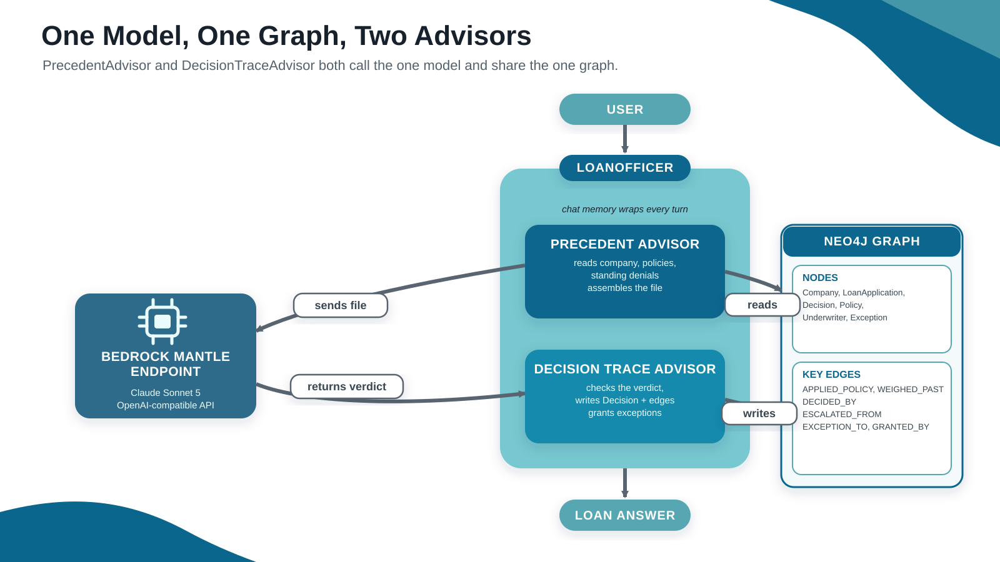
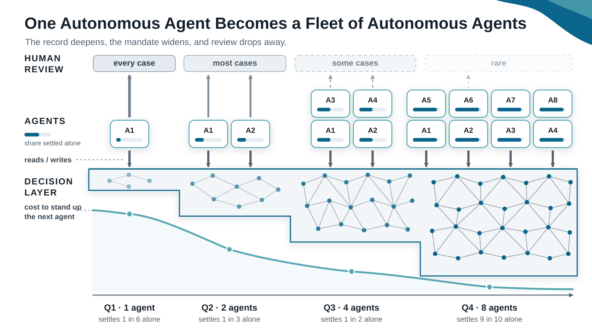

<!-- _class: lead -->

# The Decision Layer
### Shared reasoning for Spring AI agents


Ryan Knight · ryan.knight@neo4j.com


James Ward · jwdev@amazon.com

---

## Smarter Models Need Business Context

- **Model capability**: Frontier models reach human-level performance on many defined tasks.
- **Business results**: 95% of enterprise GenAI programs report no measurable return.
- **The business runs the same way it did**: The org chart, the approvals, and the escalation paths are all unchanged.
- **Missing context**: Agents cannot use knowledge held in employee experience, approvals, and past decisions.

> **Business value requires a capable model and the context that guides its decisions.**

<!--
Source: MIT Project NANDA, "The GenAI Divide: State of AI in Business 2025."
95% of organizations studied reported zero return from enterprise GenAI
investment. The report calls its own figures directional.
-->

---


<!--
Slide: Smarter Agents Need Smarter Context

A frontier model is the commodity half of the picture: identical for every
competitor. Business context is the half that is built by the enterprise, and
the agent is only as intelligent as the context it is given.
-->

---

## Data Alone Does Not Explain a Decision

- **Data**: Tells the agent what is true.
- **Policy**: Tells the agent what usually happens.
- **Decision context**: Explains how the policy applies to this case.

> **The missing layer connects business facts to business action.**

<!--
Business data describes the current state. Decision context explains how the
business applies its rules to that state.
-->

---

## What the Decision Layer Captures

- **Evidence**: The facts and trusted sources used in the decision.
- **Policy**: The rule and thresholds applied to the case.
- **Exception**: The approved change to the standard rule.
- **Decision**: The outcome, explanation, and authorizer.
- **Precedent**: Earlier decisions that apply to future cases.

> **Each decision becomes useful context for the next case.**

<!--
Use the $250,000 construction loan as the example. Show which facts came from
the trusted source, which policy applied, whether an exception changed the
rule, who authorized the outcome, and which prior decision became precedent.
-->

---


<!--
Slide: Anatomy of a Neo4j Labeled Property Graph

Three parts, and the loan domain supplies the examples. A node is a thing: a
company, an underwriter, a decision. A relationship is a typed claim about two
of them: this company SUBMITTED that application. Properties are the facts, and
they sit on relationships as well as on nodes.
-->

---


<!--
Slide: Three Kinds of Memory in One Graph

Long-term memory holds Company, Policy, and Underwriter nodes. Short-term
memory is the conversation itself, stored by Spring AI through
Neo4jChatMemoryRepository. Reasoning memory is LoanApplication, Decision, and
Exception nodes and the relationships between them.

The dashed edges are the point: the reasoning the agent writes down attaches
straight onto knowledge the business already had. A Decision names the Policy
it applied. An Exception names the Underwriter who granted it.
-->


---


<!--
Slide: Memory Lets Agents Learn Over Time

The trace is written only after the model decides, and it outlives the
conversation, so the next request starts from what prior work already proved.
Run `./run.sh C-1042 250000` twice. The company, amount, policies, and
underwriter stay fixed. Run one writes the trace. Run two reads it as precedent.
-->


---


<!--
Slide: Spring AI Advisors Are the Interception Point.
The path is request, advisor.before, model, advisor.after, response.
-->

---

## What the Advisor Gives You

- **Interception**: A `CallAdvisor` wraps the model call.
- **Two sides**: The advisor sees the request going in and the response coming out.
- **Composition**: Advisors run as a chain, and the order decides what each one sees.

---


<!--
Slide: Advisor Order Defines the Lifecycle

Both decision advisors sit outside the tool loop, so context is read once and
the decision is written once per turn.
-->

---

## Spring AI Advisor Demo

Code: github.com/jamesward/hello-spring-ai-bedrock/tree/advisors

---

## The Decision Layer Arrives as an Advisor

- **Injected**: Spring hands the agent `precedentAdvisor` and `decisionTraceAdvisor`.
- **Nothing to wire**: No Cypher, no session, no driver. The Neo4j starter supplies all three.
- **Reusable**: Any agent registers one advisor or both, and gets the same decision layer. No shared prompt, no message bus.

> **The agent asks one question. The advisor chain manages the decision context.**

<!--
An agent adopts the decision layer by registering two beans in its builder. The
agent registers them and stops there.

Worth saying out loud: the agent class names neither the driver nor the chat
memory repository. The Neo4j starter configures both.
-->

---

## Four Steps: Look Up, Check, Decide, Record

1. **Look up** the company, its policies, its standing denials, and the underwriter
2. **Check** the application against each policy threshold
3. **Decide** through the model, returned as a typed `LoanVerdict`
4. **Record** the decision and its authorization path in Neo4j

> **The model makes the judgement. Java controls the trace: an unknown policy key writes no edge, and an invented citation gets dropped.**

<!--
PrecedentAdvisor owns the read path. DecisionTraceAdvisor owns the write path.
-->

---

## Loan Decision Agent Demo

Code: github.com/retroryan/spring-decision-layer



---

## From Audit Logs to Context Graphs

| A log can answer | A graph can also answer |
|---|---|
| What happened? | Which policy authorized it? |
| Who decided it? | Which exception changed its standing? |
| When was it recorded? | Which later decisions did it govern? |

- **Only the graph holds the relationships**: policy, exception, actor, and lineage stay attached to the decision.

> **Following the relationships explains why a decision applies here.**

<!--
A log stores fields about a decision. A graph stores the relationships
between decisions, and those relationships are what prove a past decision
applies here. Both stores hold the same decision record; only the graph
keeps policy, exception, actor, and lineage attached to it. Following those
relationships produces the explanation, so application code stops
reassembling it.
-->

---


<!--
Slide: Walking from Company to Authorization

Start at one denial and follow its relationships: current query, company,
application, prior decision, the policy that governed it, the exception that
modified it, and the later decisions it influenced.
-->

---

## Cypher Finds Decisions That Still Apply

```cypher
MATCH (:Company {companyId: $companyId})-[:SUBMITTED]->(:LoanApplication)
      <-[:ABOUT]-(d:Decision {outcome: 'DENIED'})
WHERE d.decidedAt > datetime() - duration({months: $windowMonths})
  AND NOT EXISTS { (:Exception)-[:EXCEPTION_TO]->(d) }
RETURN d
```

> **One traversal checks the company, time window, and active standing.**

---

## Each Hop Adds a Piece of the Explanation

- **`APPLIED_POLICY`**: Names the rule that authorized the decision and carries the numbers that were measured.
- **`EXCEPTION_TO`**: Following it backward finds the exception that waived the denial.
- **`ESCALATED_FROM`**: Following it backward finds every later decision the denial drove.

> **One traversal returns the authority, the modification, and the lineage together.**

---


<!--
Slide: Filter with the Graph, Then Rank by Similarity

Traverse identity, policy, time, standing, and lineage; collect the decisions
that can govern this case; rank that eligible set by semantic similarity; then
ground the model with the decision path. This keeps the prompt small and avoids
sending irrelevant decisions to the model.
-->

---

## What the Decision Layer Delivers

<div class="columns" style="font-size: 24px; gap: 2.4em;">
<ul style="line-height: 1.55;">
<li><strong>Accuracy</strong>: Grounds answers in verified evidence.</li>
<li><strong>Relevance</strong>: Retrieves only the context the task needs.</li>
<li><strong>Persistence</strong>: Keeps context beyond one prompt.</li>
<li><strong>Governance</strong>: Links decisions to policy and authority.</li>
</ul>
<ul style="line-height: 1.55;">
<li><strong>Long-running work</strong>: Preserves state across steps and sessions.</li>
<li><strong>Shared memory</strong>: Lets every agent reuse prior decisions.</li>
<li><strong>Lower cost</strong>: Filters context before the model call.</li>
</ul>
</div>

> **One shared record improves every agent that reads it.**

<!--
Summarize what the decision layer gives every agent that reads it. Emphasize
governance, shared memory, and lower cost because the demo shows those benefits
directly. The next slides show who collects these benefits. Every agent on the
fleet reads the same layer.
-->

---


<!--
Slide: One Agent Builds It, Every Agent Uses It

The first agent writes policies, exceptions, and precedent into the graph. Every
agent added after that reads the same layer instead of rebuilding it. Each new
agent keeps a focused prompt and stays cheap to stand up.
-->

---

## Expanding to Other Agent Platforms

The same graph works outside Spring AI. Any language or agent framework can read
and write the decision layer.

- **Official drivers**: Neo4j ships drivers for Java, Python, JavaScript, .NET, Go, and Rust. Your agent connects with the driver for its own language.
- **One graph, many clients**: Every client reads and writes the same nodes and relationships. A Python agent sees the decisions a Java agent recorded.
- **MCP server**: The Neo4j MCP server exposes the graph to any MCP client. The agent inspects the schema, runs read queries, and writes only when you enable writes.
- **No rebuild required**: New platforms reuse the policies, exceptions, and precedent already in the graph. You add a connection, not a new decision layer.

> **Build the decision layer once. Connect every agent to it.**

<!--
The decision layer is infrastructure, not a Spring AI feature. Drivers cover the
common languages, and the MCP server covers agents that speak MCP. Mention that
MCP write access is opt-in.
-->

---


<!--
Slide: Towards Autonomous Agents

Capture business context, improve the context, then autonomous agents. This
talk builds the capture step. An autonomy gate reads from it.
-->

---



<!--
Slide: One Autonomous Agent Becomes a Fleet of Autonomous Agents

Start with one agent. It settles about one case in six on its own, and a human
reviews the rest. Every reviewed case writes a decision into the layer, so the
record of settled cases grows.

The second agent reads that record. It starts with the policies, exceptions, and
precedent the first agent already established, so it needs less review from day
one. Each agent you add costs less to stand up than the one before it.

Autonomy widens as the record deepens. By the fourth quarter the fleet settles
nine cases in ten alone, and human review moves to the rare case. The graph is
what makes this possible. One agent's decisions become every other agent's
starting point.
-->

---

## Agents That Learn the Why

> **The decision layer is where your agents learn the why. That is what makes them trustworthy, and trust is what lets a supervised fleet of agents grow into an autonomous fleet.**

---

<!-- _class: lead -->

# Questions?

Ryan Knight · ryan.knight@neo4j.com

James Ward · jwdev@amazon.com
