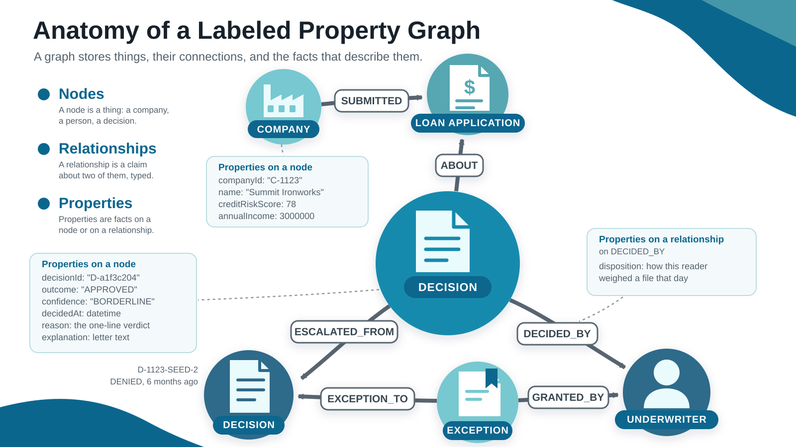
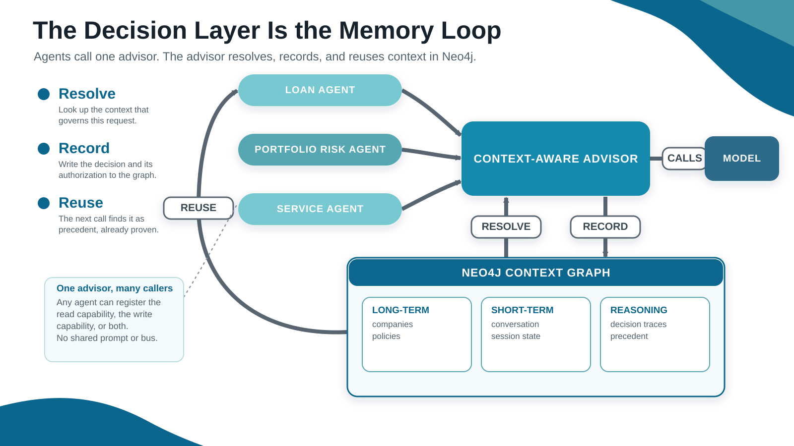
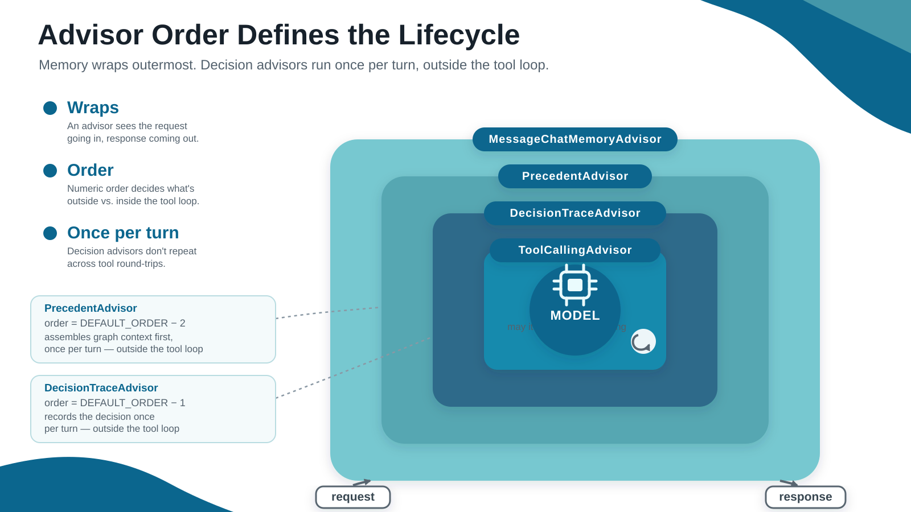
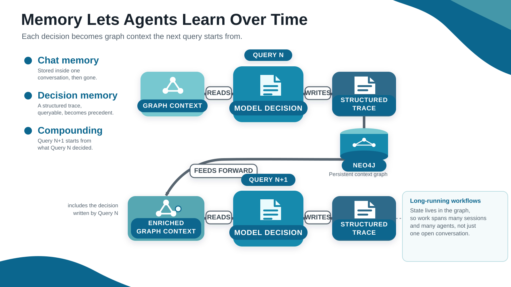
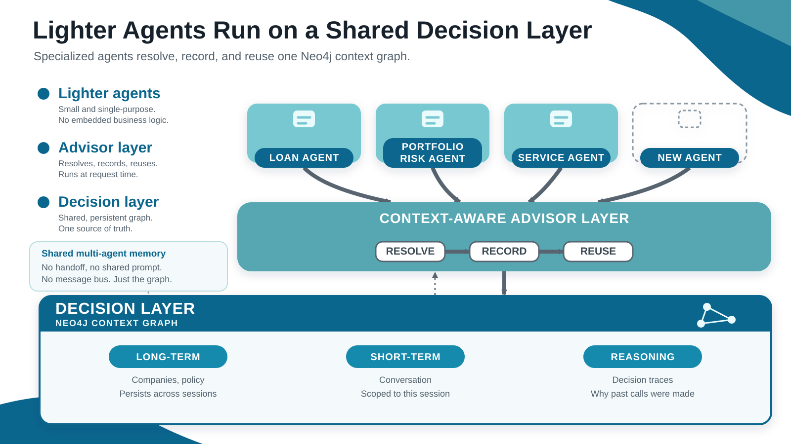

# The Decision Layer

## Slide 1: Title

# The Decision Layer
### Shared reasoning for Spring AI agents

---

## Slide 2: The Smartest Model We Have Ever Had, and Nothing Changed

- **The model is extraordinary**: It reasons, plans, writes code, and calls
  tools better than most of the people it works alongside.
- **The results are not**: 95% of enterprise GenAI programs report zero return.
- **The business runs the same way it did**: The org chart, the approvals, and
  the escalation paths are all unchanged.

**The model is not the reason these projects fail.**

<small>MIT Project NANDA, *The GenAI Divide: State of AI in Business 2025*. 95%
of organizations studied reported zero return from enterprise GenAI investment.
The report calls its own figures directional.</small>

---

## Slide 3: Smarter Agents with Smarter Context

```text
       COMMODITY                  UNIQUE ENTERPRISE VALUE
 +--------------------+          +----------------------+
 |   Frontier model   |    +     |   Business context   |
 |  identical for     |          |   yours alone, and   |
 |  every competitor  |          |   built by you       |
 +--------------------+          +----------------------+
            \                              /
             v                            v
          +----------------------------------+
          |            Your agent            |
          |  as intelligent as its context   |
          +----------------------------------+
```

- **The capability is a commodity**: Every competitor calls the same frontier
  model.
- **The context is missing**: The model knows the world. It does not know your
  business. How a process runs, which policy governs a step, and who can approve
  an exception was never written down for an agent to read.
- **The context is the advantage**: What you capture about how the business
  decides is the only part nobody else can buy.

**Commodity intelligence is the same for everyone. The business context an
enterprise builds around it is the advantage.**

---

## Slide 4: Ground an Agent with a Decision Layer

Documents tell an agent what the company published. Decisions tell it how the
company operates.

A construction company asks for a $250,000 loan. Four things settle the case:

- **Business meaning**: A definition inside the company decides what "active
  customer" counts as. The agent guesses at it.
- **Authoritative source**: One of five systems holds the number people trust.
  The agent cannot tell which one.
- **Standing exception**: Someone approved a bend in the rule last quarter. That
  approval lives in a closed thread.
- **Prior judgement**: A person already settled a case like this one. The reason
  went nowhere the agent can read.

That context is not missing from the company. It sits in the heads of the people
who have been there long enough to know.

**Every company has one person everyone taps on the shoulder. The agent cannot
tap them.**

The last two are decisions, and decisions are the half that can be captured. A
decision layer writes each one down with what authorized it, then reads it back
on the next query, so an agent starts where the last one finished instead of
deciding from zero.

<small>Business meaning and authoritative source need an ontology and a source
map. This talk builds the decision layer.</small>

---

## Slide 5: Anatomy of a Decision Graph



The picture makes four claims: what was decided, what authorized it, what
modified it, and what it relied on.

---

## Slide 6: Three Kinds of Memory in One Graph

```text
Long-term memory     Company, Policy, Underwriter nodes
Short-term memory    Spring AI chat memory, Neo4jChatMemoryRepository
Reasoning memory     Decision and Exception nodes, and their relationships
```

- **Long-term memory**: The graph holds enterprise knowledge as nodes. Companies,
  policies, underwriters, and thresholds all live there.
- **Short-term memory**: Spring AI stores the conversation itself through
  `Neo4jChatMemoryRepository`, in the same database.
- **Reasoning memory**: `Decision` nodes hold what was decided and what
  authorized it. This is the memory that becomes precedent.

**One Neo4j instance runs all three. Only reasoning memory changes the next
outcome.**

---

## Slide 7: The Decision Layer Is the Memory Loop



Every agent shares one advisor and one graph: resolve the context that governs
the request, record what was decided, reuse it as precedent.

---

## Slide 8: What Grounded Context Buys You

| Benefit | What it buys you |
|---|---|
| **More accurate answers** | The agent decides on real evidence instead of a guess |
| **Explainability and governance** | Every decision names the policy and the person behind it |
| **Persistent context** | Context has a place to live beyond one prompt |

**Each one needs the same thing: a record of how the company decides.**

---

## Slide 9: Spring AI Advisors Are the Interception Point

```text
request -> advisor.before -> model -> advisor.after -> response
```

- **Interception**: A `CallAdvisor` wraps the model call.
- **Two sides**: The advisor sees the request going in and the response coming
  out.
- **Composition**: Advisors run as a chain, and the order decides what each one
  sees.

---

## Slide 10: Advisor Order Defines the Lifecycle



Both decision advisors sit outside the tool loop, so context is read once and
the decision is written once per turn.

---

## Slide 11: The Decision Layer Arrives by Injection

An agent adopts the decision layer by registering two beans in its builder.

- **Injected advisors**: Spring hands the agent `precedentAdvisor` and
  `decisionTraceAdvisor`. The agent registers them and stops there.
- **Implicit dependency**: The Neo4j starter configures the driver and the chat
  memory repository. The agent class names neither.
- **No graph code**: The agent holds no Cypher and opens no session.
- **Reusable**: Any agent that registers the same two advisors gets the same
  decision layer.

**The agent asks one question. The advisor chain manages the decision context.**

---

## Slide 12: Four Steps: Look Up, Check, Decide, Record

1. **Look up** the company, its policies, its standing denials, and the
   underwriter
2. **Check** the application against each policy threshold
3. **Decide** through the model, returned as a typed `LoanVerdict`
4. **Record** the decision and its authorization path in Neo4j

`PrecedentAdvisor` owns the read path. `DecisionTraceAdvisor` owns the write
path.

**The model makes the judgement. Java controls the trace: an unknown policy key
writes no edge, and an invented citation gets dropped.**

---

## Slide 13: Each Decision Becomes Context for the Next



The trace is written only after the model decides, and it outlives the
conversation, so the next request starts from what prior work already proved.

---

## Slide 14: Connections Are the Evidence

A log stores fields about a decision. A graph stores the links between
decisions, and those links are what prove a past decision applies here.

| A log can answer | A context graph can answer |
|---|---|
| What happened? | Which policy authorized it? |
| Who decided it? | Which exception changed its standing? |
| When was it recorded? | Which later decisions did it govern? |

- **Both hold the decision**: The fields are the same in either store.
- **Only the graph holds the links**: Policy, exception, actor, and lineage stay
  attached to the decision.
- **The path is the explanation**: Following the links produces the reason, so
  application code stops reassembling it.

**Connection decides whether a past decision applies to this case.**

---

## Slide 15: Start at the Company to Find Relevant Decisions

The search starts at the company and follows its applications to past decisions.
Three tests then decide which of those denials still count.

- **Ownership**: The traversal starts at the company node and reaches its
  decisions through `SUBMITTED` and `ABOUT`.
- **Age**: The denial falls inside the window the policy sets.
- **Standing**: No exception has set the denial aside.

```cypher
MATCH (:Company {companyId: $companyId})-[:SUBMITTED]->(:LoanApplication)
      <-[:ABOUT]-(d:Decision {outcome: 'DENIED'})
WHERE d.decidedAt > datetime() - duration({months: $windowMonths})
  AND NOT EXISTS { (:Exception)-[:EXCEPTION_TO]->(d) }
RETURN d
```

**The company anchors the search, and every test is a relationship, so one
query settles all three.**

---

## Slide 16: Walking the Graph from Company to Authorization

Start at one denial and follow its relationships. Each hop adds a piece of the
explanation.

```text
Current query
  -> Company
  -> Application
  -> Prior Decision
  -> Policy that governed it
  -> Exception that modified it
  -> Later decisions it influenced
```

- **`APPLIED_POLICY`**: The edge names the rule that authorized the decision and
  carries the numbers that were measured.
- **`EXCEPTION_TO`**: Following it backward finds the exception that set the
  denial aside.
- **`ESCALATED_FROM`**: Following it backward finds every later decision the
  denial drove.

**One traversal returns the authority, the modification, and the lineage
together.**

---

## Slide 17: Filter with the Graph, Then Rank by Similarity

Traversal decides which past decisions can govern this case. Similarity ranks
what survives.

```text
Query
  -> traverse identity, policy, time, standing, and lineage
  -> collect the decisions that can govern this case
  -> rank that eligible set by semantic similarity
  -> ground the model with the decision path
```

- **Traversal first**: The graph filters by company, policy, time, standing, and
  lineage.
- **Ranking second**: Vector search orders the decisions that survived the
  filter.
- **Smaller prompt**: The agent sends the decisions this case needs.
- **Lower cost**: The graph filters before anything reaches the model.

---

## Slide 18: The Second Run Sees the First Run's Decision

```shell
./run.sh C-1042 250000
./run.sh C-1042 250000
```

- **Run one**: The agent decides and writes a decision trace.
- **Run two**: The agent reads that trace as standing precedent.
- **Everything else is fixed**: Company, amount, policies, and underwriter stay
  the same.

**The graph changed between the runs, so the context changed with it.**

---

## Slide 19: Lighter Agents Run on a Shared Decision Layer



Agents in the same system share data. They do not share reasoning. One graph is
the only channel they need, because what travels through it is the reasoning
behind a decision rather than the data it was about.

---

## Slide 20: Towards Autonomous Agents

```text
Capture business context  ->  Improve the context  ->  Autonomous agents
```

- **Capture**: Every decision writes down its outcome and its authorization.
  Approvals, overrides, and exceptions land in the same record.
- **Improve**: Each request starts from that record, so the next decision has
  stronger context than the last one.
- **Autonomous**: The agent acts alone on cases the record already shows how to
  settle.

**Autonomy becomes possible when the agent learns to decide the way your
business does.**

<small>This talk builds the capture step. An autonomy gate reads from it.</small>

---

## Slide 21: The Asset Your Agents Build for You

The decision layer is not a feature the agents use. It is an asset they leave
behind, and it is worth more every quarter it runs.

- **Governance stops being a project**: Every decision already names the policy
  that authorized it and the person who signed it. The audit is a traversal.
- **Each new agent starts ahead of the last**: The fifth agent inherits what the
  first four settled, so it costs less to stand up than the one before it.
- **The company learns where its own rules are wrong**: The traces show which
  policies get overridden in practice, and how often.
- **The record outlives the model**: Frontier models will keep changing. What
  the business decided, and why, does not change with them.

**Swap the model next year and the advantage stays, because the advantage was
never the model.**

---

## Slide 22: Questions

# What organizational context do your agents still have to guess?
